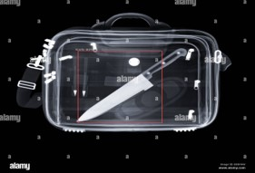
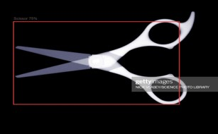
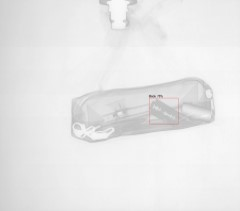
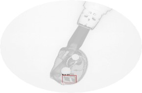
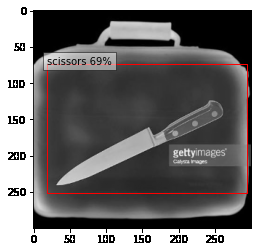
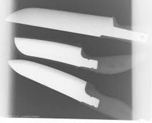
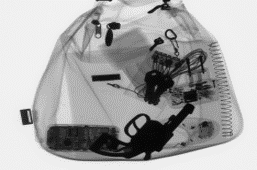
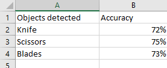

## Object Detection - Identify harmful objects in X-ray image of Baggages 

## Introduction of the MM811 Project

In areas of high security, like airports, etc, X-Ray machines are used to scan baggage
to look for hazardous objects. But, in a manual scan, it is easy to miss some details.
Create a model to detect harmful/hazardous objects like razor blades/handguns in
X-Ray images of baggage

The input size of the image is 300X300

We will carry out object detection in images using SSD object detector with  a ResNet50 neural network backbone.

## Project Directory Structure

```
│ 811_project.ipynb
├───input
│ image_1.jpg
│ image_2.jpg
│ ...
│
├───outputs
│ image_1.jpg
│ image_2.jpg
│ ...
```
## Implementation

```

go to google colab and upload 811_project.ipynb
execute the code

```

## Draw_boxes in the 2nd cell of the code

The bounding boxes around the items in an image are drawn. Three parameters are sent to draw bboxes(). Image, results, and classes to labels are the three. Before any resizing or other augmentations/transforms, image is the original input picture or frame. The bounding box coordinates, labels, and confidence scores for the discovered items are included in the findings. The classes to labels variable holds the names of the class labels from the dataset that we trained using X-RAY pictures.

```
def draw_bboxes(image, results, classes_to_labels):
    for image_idx in range(len(results)):
        image = cv2.cvtColor(image, cv2.COLOR_RGB2BGR)
        # get the original height and width of the image to resize the ...
        # ... bounding boxes to the original size size of the image
        orig_h, orig_w = image.shape[0], image.shape[1]
        # get the bounding boxes, classes, and confidence scores
        bboxes, classes, confidences = results[image_idx]
        for idx in range(len(bboxes)):
            # get the bounding box coordinates in xyxy format
            x1, y1, x2, y2 = bboxes[idx]
            # resize the bounding boxes from the normalized to 300 pixels
            x1, y1 = int(x1*300), int(y1*300)
            x2, y2 = int(x2*300), int(y2*300)
            # resizing again to match the original dimensions of the image
            x1, y1 = int((x1/300)*orig_w), int((y1/300)*orig_h)
            x2, y2 = int((x2/300)*orig_w), int((y2/300)*orig_h)
            # draw the bounding boxes around the objects
            cv2.rectangle(
                image, (x1, y1), (x2, y2), (0, 0, 255), 2, cv2.LINE_AA
            )
            # put the class label text above the bounding box of each object
            cv2.putText(
                image, classes_to_labels[classes[idx]-1], (x1, y1-10),
                cv2.FONT_HERSHEY_SIMPLEX, 0.8, (0, 255, 0), 2
            )

    return image
```

## Loading SSD Model

```
ssd_model = torch.hub.load('NVIDIA/DeepLearningExamples:torchhub', 'nvidia_ssd', map_location=torch.device('cpu'))
ssd_model.to(device)
ssd_model.eval()
utils = torch.hub.load('NVIDIA/DeepLearningExamples:torchhub', 'nvidia_ssd_processing_utils')
```

## Read the image and prepare the input data

```
read the image
image_path = "/content/x-ray-image-showing-briefcase-containing-knife-CTF3RC.jpg"
image = cv2.imread(image_path)
```

## Feed our input data to the SSD object detector model

The labels are downloaded into the current directory. There will be a text file named category names.txt that contains 80 COCO classes when you download it.

```
classes_to_labels = utils.get_coco_object_dictionary()
```

**Build With**

- [Pytorch](https://github.com/pytorch/pytorch)

## Installation

- [Torch](https://github.com/pytorch)
- [OpenCV](https://docs.opencv.org/4.x/d6/d00/tutorial_py_root.html)
- [TorchVision](https://github.com/pytorch/vision)

**Language used**

-Working with Python: Codes have been written in python which is compact, easier to debug, and allows for ease of extensibility.

## Output of the Project

While implementing the project, we saw different test cases such as detecting correct result and other test case was detecting wrong items or even not detecting them when they were passed through the code.

`Correct Result Obtained`

**Knife detection**


**Scissors detection**


**Blade detection**


**Blade detection**


`False Result Obtained`

**Knife detected as scissors**


**Multiple knife not detected**


**Guns undetected**



## Accuracy obtained while detection and explanation



We have found that the result showed that it can detected only knives, blades and scissors but it cannot detect guns and it cannot detect multiple objects in the image which is making it less effective than other models present.

## **Dataset used has been mentioned in the readme files for every question.**

- GDXray (https://domingomery.ing.puc.cl/material/gdxray/)

## **References**

Object Detection using SSD, Resnet50 and Pytorch https://debuggercafe.com/object-detection-using-ssd300-resnet50-and-pytorch/

PyTorch SSD model implementation. https://pytorch.org/hub/nvidia_deeplearningexamples_ssd/

https://alert.northeastern.edu/assets/adsa/adsa17_presentations/07_Breckon.pdf

## **Organization We worked with**

```
AltaML
```
Contact Details
```
● Harsh Sharma: harsh@altaml.com
● Sara Soltaninejad: sara@altaml.com
```
